# 메모리 할당
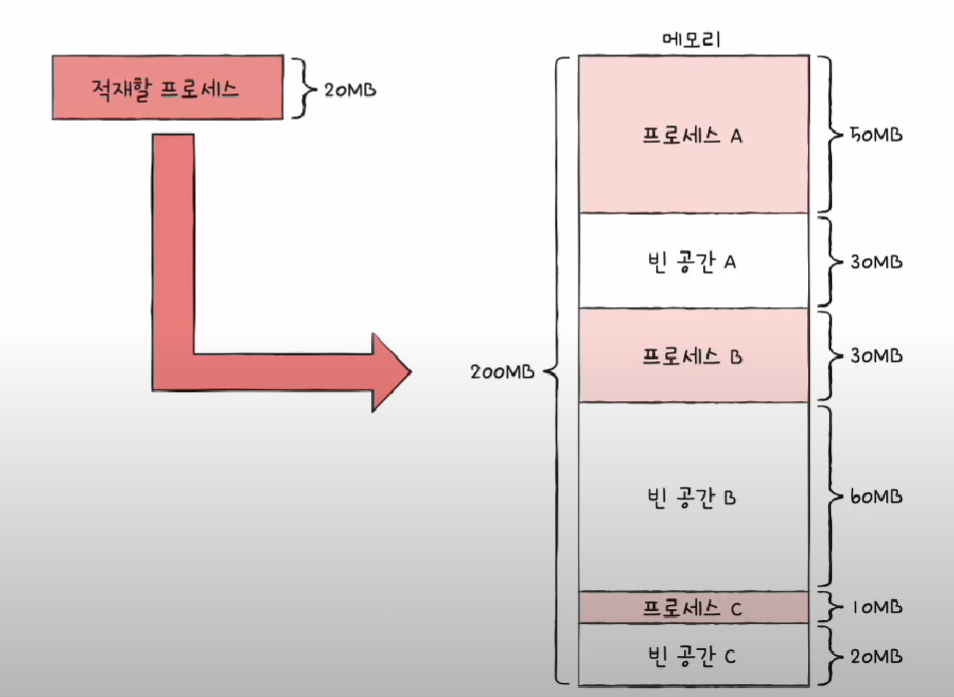
- 사진과 같이 메모리의 빈 공간에 프로세스가 할당되어야 한다.

## 연속 메모리 할당
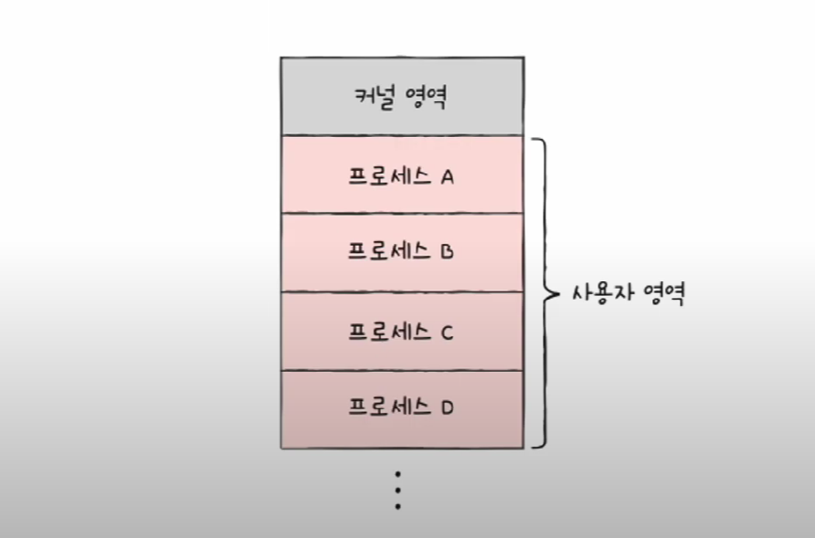
- 말 그대로 프로세스에 연속적으로 메모리공간이 할당되는 것

### 연속 메모리 할당 문제점
- 외부 단편화

- 물리 메모리보다 큰 프로세스 실행 불가

### 최초 적합
- 운영체제가 메모리 빈공간을 순서대로 검색하고 적재할 수 있는 공간에 프로세스를 배치하는 방식

- 검색 최소화, 빠른 할당

### 최적 적합
- 운영체제가 메모리 빈 공간을 모두 검색한 후, 적재 가능한 가장 작은 공간에 할당

### 최악 적합
- 운영체제가 빈공간을 모두 검색한 뒤 가장 큰 공간에 할당

## 외부 단편화
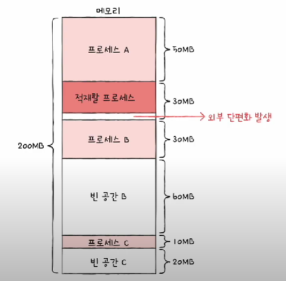

- 프로세스가 실행되고 종료되면 메모리의 빈 공간이 발생

- 위의 그림처럼 30MB 의 빈공간에 25MB의 프로세스가 적재된다면 5MB의 메모리 낭비가 발생

## 외부 단편화 해결법

### 메모리 압축
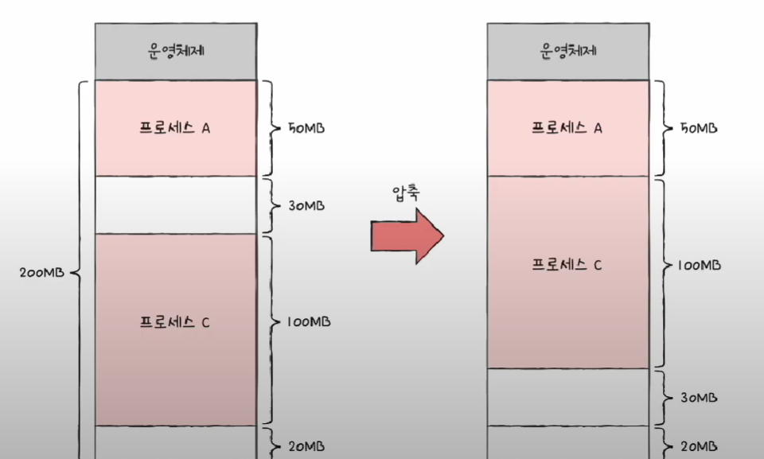
- 빈 공간을 하나로 합치는 방식

- 재배치하는 과정에서 오버헤드 발생

- 프로세스를 어떻게 배치해야 최소한의 오버헤드를 발생시킬지에 대해 불명확

### 가상 메모리 기법

- 실행하고자 하는 프로그램 일부를 메모리에 적재하여 실제 메모리 크기보다 더 큰 프로세스를 실행할 수 있게 하는 기법

- 페이징, 세그멘테이션

### 페이징

#### 외부 단편화가 발생한 원인
- 각자 다른 크기의 프로세스가 메모리에 연속적으로 할당되었기 떄문

- 이를 해결 가능한 것이 페이징

#### 페이징이란

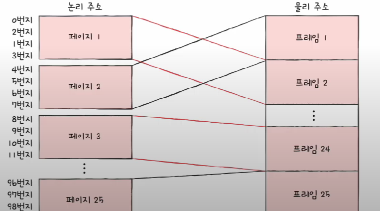

- 프로세스의 논리 주소 공간을 페이지라는 '일정 단위'로 자름

- 메모리의 물리적 주소 공간을 프레임이라는 페이지와 동일한 일정한 단위로 자름

- 따라서, 페이징이랑 페이지를 프레임에 할당하는 가상 메모리 관리 기법

- 페이징에서도 스왑인, 스왑아웃 가능

- 필요 없는 페이지는 보조기억장치(스왑영역)로 필요한 페이지는 메모리로

- 즉, 메모리보다 큰 프로세스도 실행될 수 있다.

 

# 스와핑
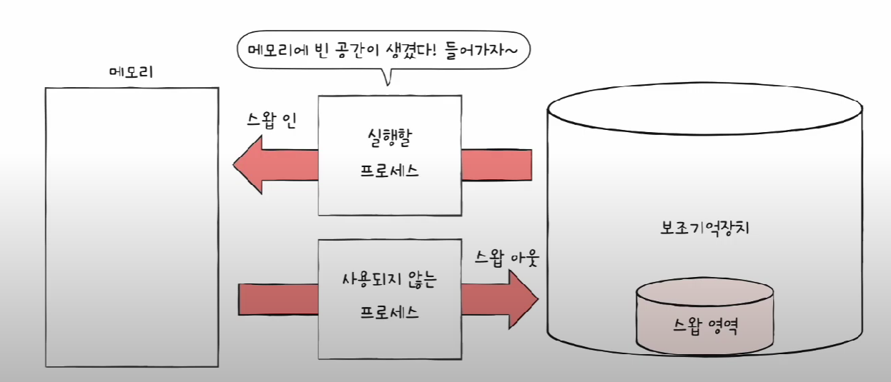
- 현재 사용중이 아닌 프로세스를 보조기억장치의 스왑 영역으로 내보내고 그 과정으로 인해 생긴 메모리의 빈 공간에 새 프로세스를 넣는 것

- 불필요한 프로세스를 보조기억장치에 저장함에 따라 메모리를 효율적으로 사용할 수 있음

- 스왑인, 스왑아웃 하는 과정을 통해 실제 물리 메모리 크기보다 큰 프로세스를 사용할 수 있다.

#### 페이지 테이블
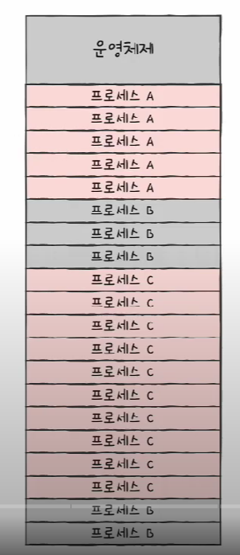

- 이렇게 불연속적(프로세스B가 서로 떨어진 것처럼)으로 프로세스 페이지가 페이징되어 있으면 CPU 입장에서 어느 프레임에 적재되어 있는지 알기 어렵다.

- 이것을 해결하기 위해 페이지 테이블이라는 것이 등장

- 즉, 페이지 번호와 프레임 번호를 매칭해주는 것

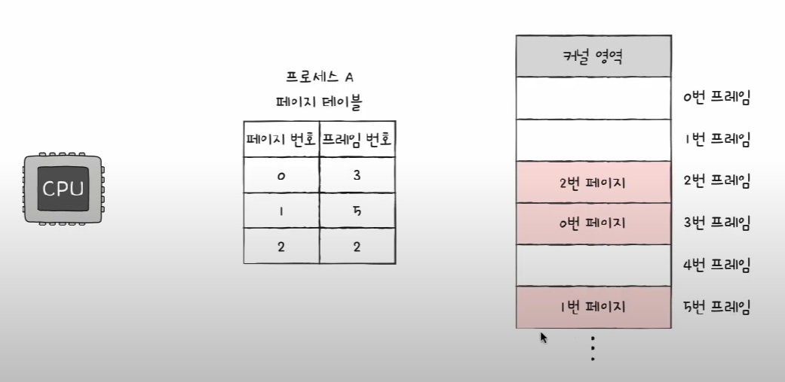

- 위와 같이 프로세스마다 페이지 테이블이 존재

- CPU는 페이지 테이블을 통해 프레임에 접근 가능

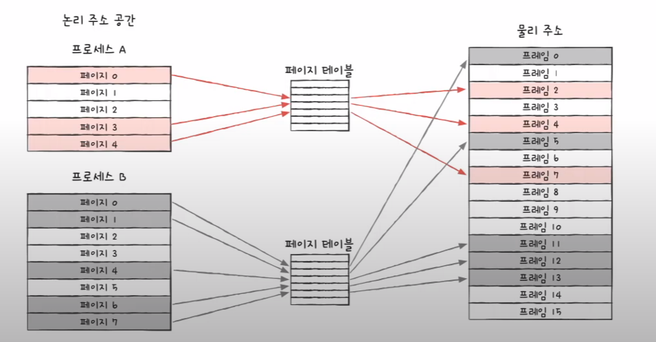

- 물리적으로는 분산되어 저장

- 하지만 CPU입장에서는 페이지테이블을 참조하여 논리 주소를 순차적으로 실행하면 된다.

### 내부 단편화

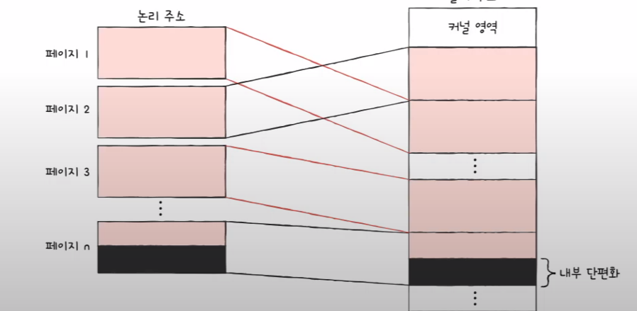

- 페이징을 통해 외부 단편화는 해결할 수 있지만, 내부 단편화라는 문제가 발생할 수 있다.

- 프로세스를 분할하는 페이지의 크기가 배수에 딱 맞게 나누어 떨어지지 않을 수 있기 때문

- 예를들어 프로세스 크기가 108이고 페이지 크기가 10이면 8이라는 공간이 낭비됨

- 대부분, 외부 단편화 공간 낭비보단 크기가 작음

### PTBR
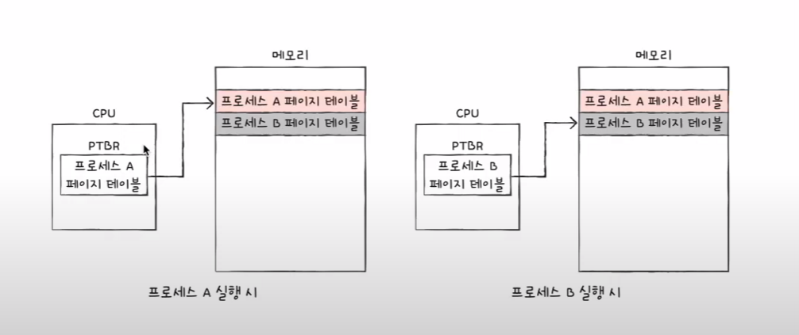

- 프로세스마다 페이지 테이블이 존재

- 또한, 이들을 가리키는 PTBR(페이지 테이블 베이스 레지스터)도 존재

- CPU 내에 존재

### TLB

- 페이지 테이블이 메모리에 있다면 페이지 테이블을 참조할 때 한 번, 페이지 참조를 참조할 때 한 번해서 총 두 번을 메모리에 접근해야한다. 메모리 접근 시간을 캐시나 레지스터에 접근하는 시간보다 상대적으로 길기 때문

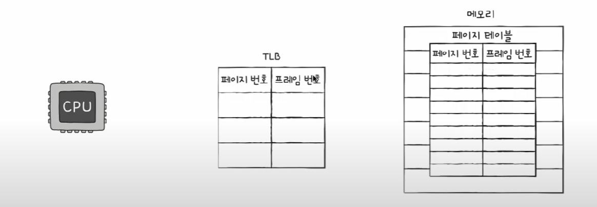

- CPU 곁에 페이지 테이블의 캐시 메모리

- 자주 참고하고 있는 페이지 테이블의 일부를 가져와 저장

- 이를 통해 불필요한 메모리 접근을 줄일 수 있다.

#### TLB히트, 미스
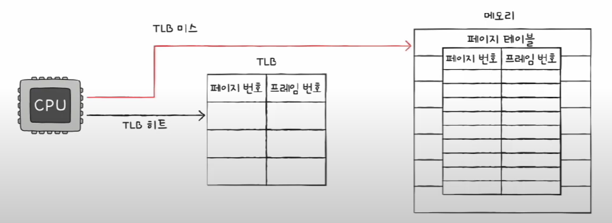

- 예전 캐시 히트, 미스와 비슷한 개념

- 논리 주소가 TLB에 있으면 메모리 접근 한 번(TLB 히트)

- 없다면, 메모리 접근 두 번(TLB 미스)
 

## 페이징 주소 변환

- 특정 주소에 접근하려면 첫째, 어떤 페이지/프레임에 접근해야하는지(페이지 번호)

- 접근하려는 주소가 그 페이지/프레임으로 부터 얼마나 떨어져 있는지에 대한 정보가 필요(변위)

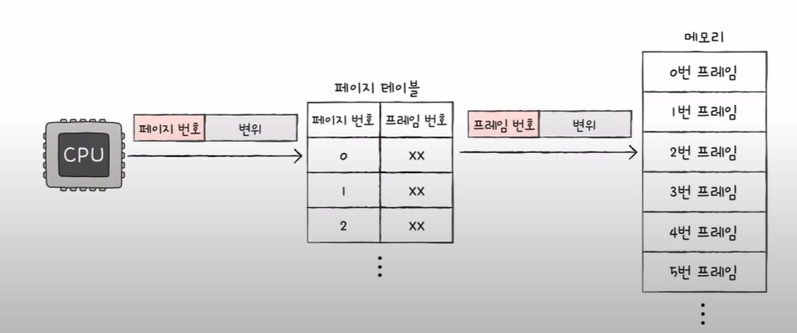

- <페이지 번호, 변위> => 페이지 테이블 => <프레임 번호, 변위>

- 페이지 번호와 프레임 번호는 같음

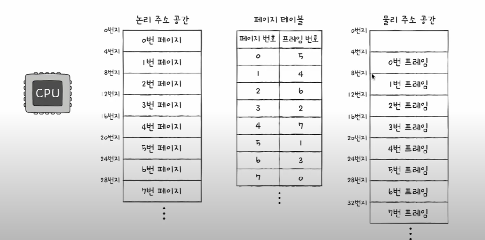

- 논리 주소가 <6, 3>인 곳에 접근하려면?

- 6번 페이지 번호에 해당하는 프레임 번호 3번에 접근 => 16번지에서 3만큼 떨어진 19번지에 접근

## 페이지 테이블 엔트리

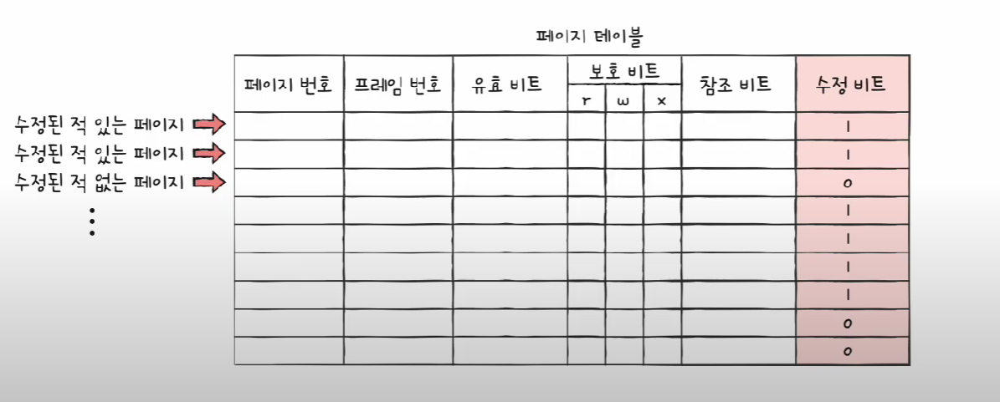

- 페이지 테이블의 각각의 행에 여러가지 정보들이 담김

### 유효 비트

- 현재 해당 페이지에 접근 가능 여부

- 메모리에 적재됨 => 1 , 적재되지 않음 => 0

- 유효 비트가 0인 페이지에 접근하면 페이지 폴트라는 인터럽트 발생

    1. CPU는 기존작업내역 백업

    2. 페이지 폴트 처리 루틴

    3. 원하는 페이지를 메모리로 가져온 뒤 유효비트 1로 변경

    4. 처리 후 해당 페이지 접근 가능

### 보호 비트
- 페이지 보호 기능을 위해 존재

- 페이지 접근 권한을 통제

- T/W/X => 읽기/쓰기/실행 권한 여부

### 참조 비트

- CPU가 접근한적이 있는지에 대한 여부

### 수정 비트(Dirty Bit)

- CPU가 해당 페이지에 데이터를 사용했는지 여부

    왜 존재하는지?

    - 메모리에서 수정된 페이지를 보조기억장치의 해당 페이지와 일치시키기위해

### 요구 페이징

- 모든 페이지를 적재하지 않고 필요 페이지만 메모리에 적재하는 기법

- 요구 페이징 시스템이 안정적으로 작동하기 위해서는 페이지 교체와 프레임 할당이 필요

## 페이징 교체 알고리즘

- 페이지들을 적재하다보면 메모리가 가득 차게 됨

- 당장 필요한 페이지를 적재하려면 페이지를 보조기억장치로 보내야함

- 이때, 어떠한 페이지를 보낼까를 결정하는 것이 페이징 교체 알고리즘

- 페이지 폴트가 적은 알고리즘이 좋은 알고리즘 => 페이지 폴트가 발생하면 보조기억장치에 접근해야 하므로 성능 저하가 일어남

    페이지 폴트
        
        프로세스가 요청한 페이지가 물리적 메모리에 없어 접근 시도가 실패할 때 발생하는 것

#### FIFO 페이지 교체 알고리즘

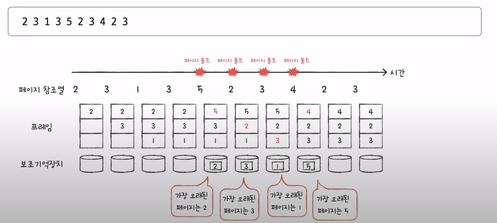

- 가장 오래된 페이지를 교체

    2차 기회 페이지 교체 알고리즘(보완책)

        CPU가 참조한 적이 있는 페이지는 오래되었더라도 바로 OUT 시키지 않음

#### 최적 페이지 교체 알고리즘

- 가장 오래 사용하지 않'을' 페이지 교체

- 앞으로 사용 빈도가 가장 낮은 페이지 교체

- 가장 낮은 페이지 폴트율을 보장

- 미래를 예측할 수 없기 때문에 구현이 어려움

- 다른 페이지 교체 알고리즘 성능 평가를 위한 기준점으로 이용

### LRU 페이지 교체 알고리즘

- 가장 오래 사용하지 않'은' 페이지 교체

## 세그멘테이션

- 페이징은 프로세스를 물리적으로 일정한 크기로 나눠 메모리에 할당하는 것이라면

- 세그멘테이션은 논리적 내용을 기반으로 나눠서 메모리에 배치하는 것을 의미

### 논리단위

- main program
- procedure
- function
- method
- object
- stack
- local variable
- global variable

프로세스를 code, data, stack 영역으로 나누는 것도 세그멘테이션

## 세그먼트 테이블

### 논리구조

- <segment-number,offset>으로 구성

- 세그먼트의 크기가 일정하지 않기 때문에 limit 정보가 추가로 들어있음

- 세그먼트의 크기를 추가하는 주소가 들어오면 인터럽트 발생 => 해당 프로세스 강제 종료

ex)
    
    1. 논리주소 <2,100> => 4300+100 => 4400(물리주소) => limit(400) 범위 안에 들어옴

    2. 논리주소 <1,500> => 6300+500 => 6800(물리주소) => limit(400) 즉, 6300~6700 범위를 벗어나므로 인터럽트 발생

## 세그멘테이션 VS 페이징
- 세그멘테이션은 보호와 공유 측면에서 페이징보다 우수하지만, 세그먼트의 크기가 일정하지 않아 외부 단편화와 메모리 낭비의 문제를 가진다.

- 반면, 페이징은 메모리를 일정한 크기로 나누어 관리하기 때문에 외부 단편화 문제를 해결하지만, 영역이 섞여 권한 설정이 더 복잡해질 수 있다.

- 현재 대부분의 시스템은 페이징 기법을 세그멘테이션보다 더 많이 사용한다.

## 프레임 할당(frame allocation)
 
- 운영 체제의 메모리 관리 과정 중 하나이다. 

- 특히 멀티태스킹 환경에서 여러 프로세스가 동시에 메모리를 요구할 때, 이를 효율적으로 관리하는 방법

### 고정 할당(Fixed Allocation)

각 프로세스에 고정된 수의 프레임을 할당. 모든 프로세스가 동일한 수의 프레임을 받거나, 프로세스의 크기나 중요도에 따라 다른 수의 프레임을 할당받을 수 있다.

### 동적 할당(Dynamic Allocation)

프로세스의 필요에 따라 프레임 수를 동적으로 조정. 프로세스가 더 많은 메모리를 요구하면 추가 프레임을 할당하고, 필요가 줄어들면 프레임을 회수한다.

#### 장점 

- 메모리 사용의 효율성을 높이고, 프로세스 간의 충돌을 방지하며, 시스템 자원을 최적화하여 사용할 수 있다.

- 운영 체제의 성능과 안정성을 유지하는 데 기여한다.

## 면접 예상 질문

Q. 가상 메모리란 무엇인지 말해달라

A. 가상 메모리는 시스템의 메모리 관리를 위한 기술로, 물리적 메모리 용량을 초과하는 프로그램 실행을 가능하게 합니다. 이는 물리 메모리와 보조 저장 장치를 활용합니다. 페이지(또는 세그먼트)라는 단위로 메모리를 관리하며, 필요에 따라 페이지를 메모리와 보조 저장 장치 사이를 스와핑합니다. 이를 통해 각 프로세스는 자신만의 독립된 메모리 공간을 가지고 있는 것처럼 작동할 수 있으며, 메모리 사용의 효율성을 높이고 프로세스 간의 메모리 충돌을 방지할 수 있습니다.

### 키워드

- 메모리 관리

가상 메모리가 메모리 관리 기술 중 하나임을 명시

- 물리적 메모리 용량 초과

가상 메모리의 주요 목적 중 하나는 제한된 물리적 메모리를 효율적으로 사용하는 것

- 보조 저장 장치 활용

가상 메모리가 하드 디스크나 SSD 같은 보조 저장 장치를 사용하여 메모리 공간을 확장한다는 점

- 페이지/세그먼트

이 단위로 메모리를 관리하는 방법을 설명

- 스와핑

물리 메모리와 보조 저장 장치 사이에 데이터를 이동시키는 과정 설명

- 독립된 메모리 공간

각 프로세스가 마치 자신만의 메모리 공간을 가진 것처럼 작동할 수 있다는 점을 강조

- 메모리 사용 효율성 및 프로세스 간 충돌 방지

가상 메모리의 주요 이점

